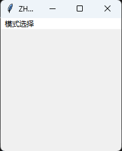
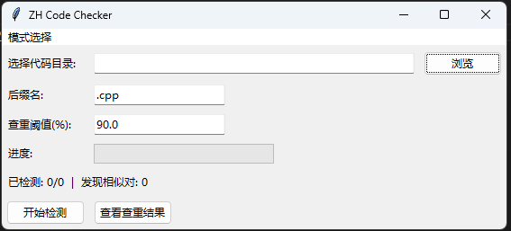
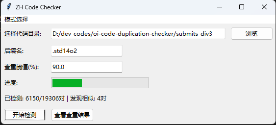
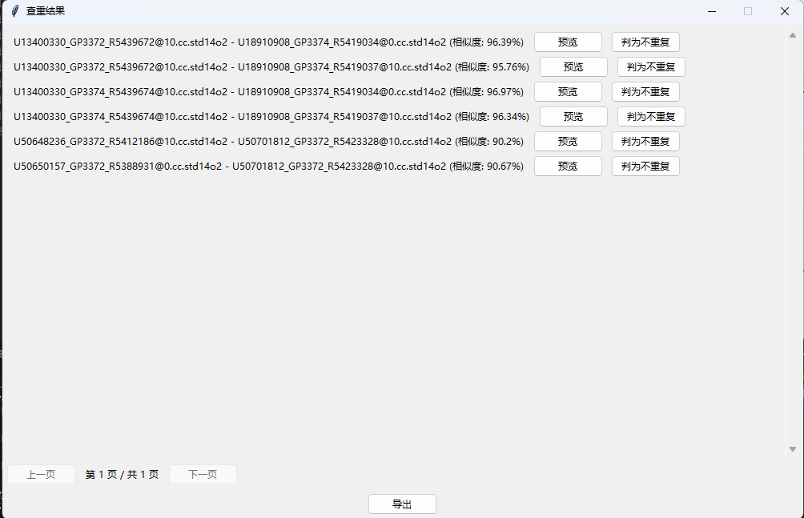
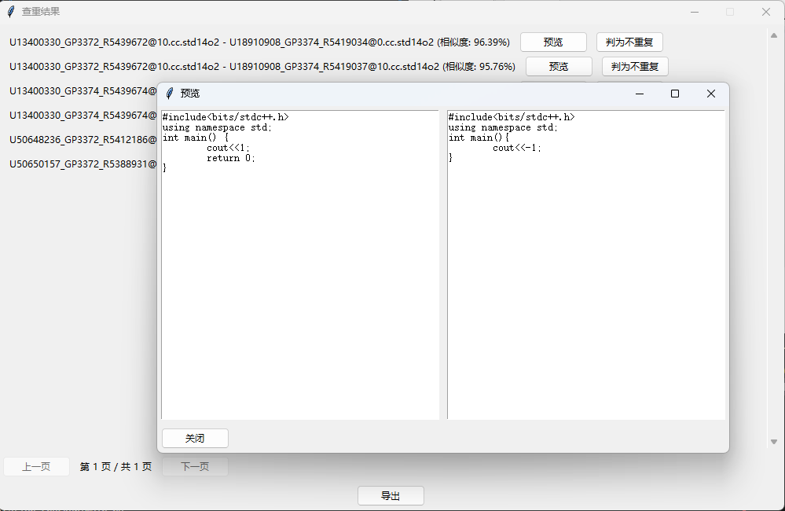
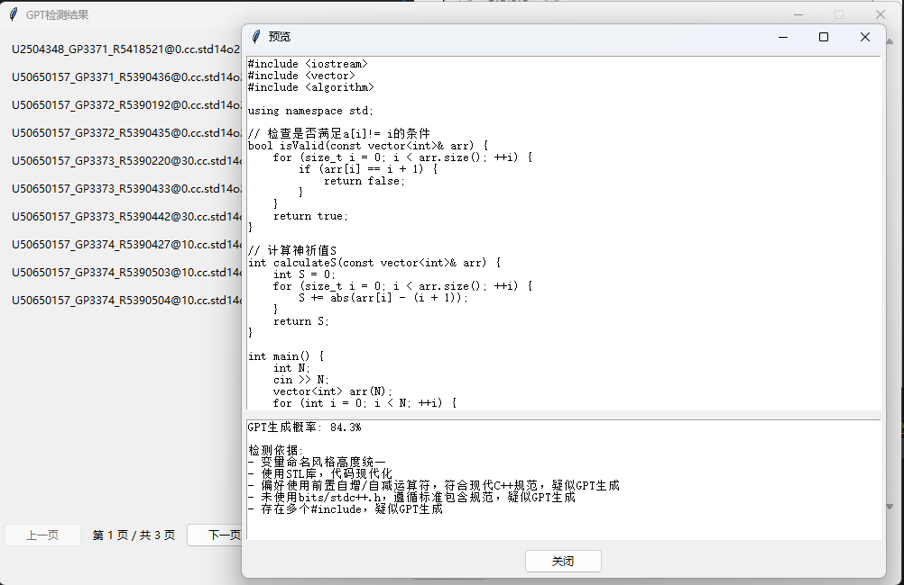

# zh-code-checker

oi 比赛代码查重/GPT 生成代码检测

## 项目介绍

随着 OI 系列比赛的不断发展，在 OI 系列比赛中提交他人代码或使用 ChatGPT 生成代码的现象越来越普遍。为了保证比赛的公平性，我们需要对参赛选手的代码进行查重。本项目旨在实现代码查重和 GPT 生成判定。

## 功能特性

- 支持代码查重
- 支持 GPT 生成代码检测
- 支持导出检测结果至 csv 文件
- 手动复核

## 软件截图

### 代码查重

### GPT 生成代码检测

### 使用方法

1. 从 release 中下载最新版本的 exe 文件或者使用源码编译。

2. 将所有代码放入一个文件夹，文件命名为 `{选手姓名/ID}_xxxxxxx.{后缀}`。

    例如：

    `U549916_GP3367_R5419842@100.cc.std14o2`
    `张三_edit.cpp`

3. 打开软件，选择模式，选择文件夹，点击开始。

## 注意事项

1. 经测试，查重阈值为 $0.9$ 时，查重效果较好；GPT 生成代码检测阈值为 $0.5$ 时效果较好。

2. 目前检测方法还很简单，未来会继续优化，也欢迎大神 PR。

3. 本项目仅供学习交流使用。